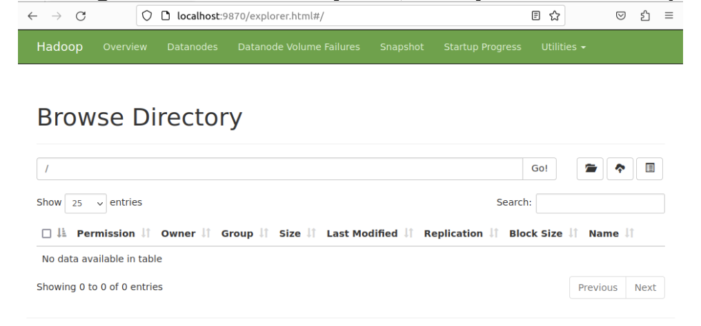
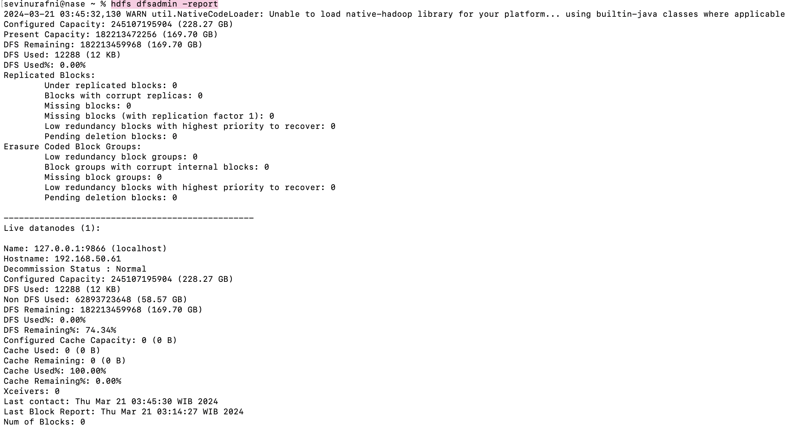
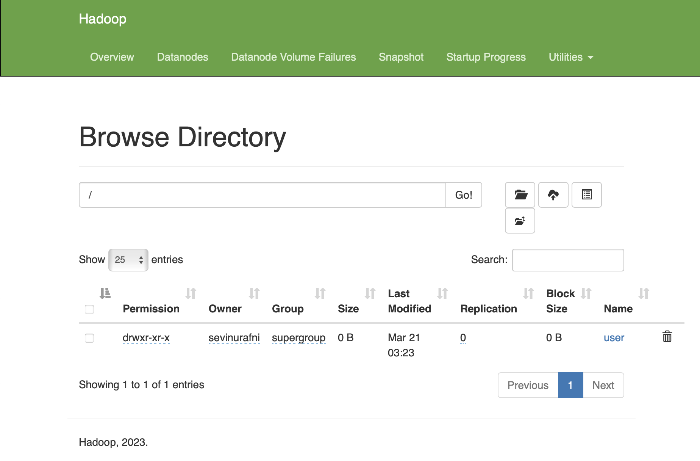
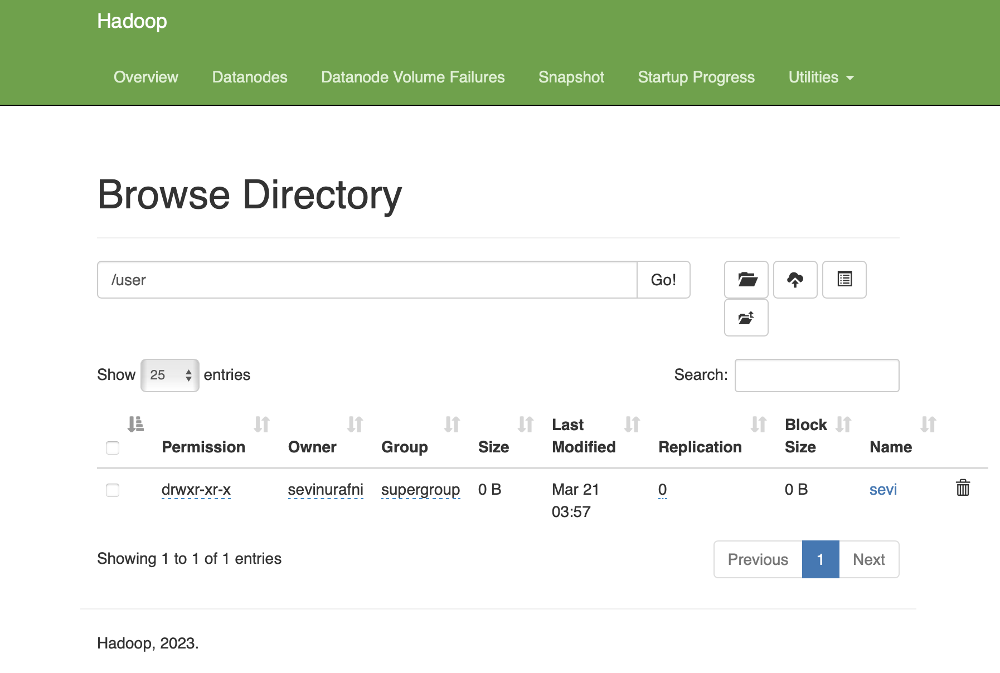
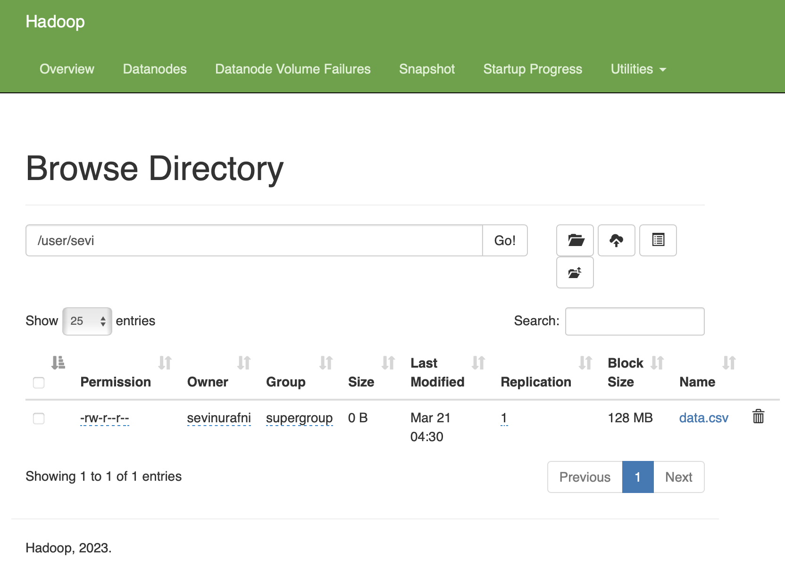

### Step-by-step tutorial on how to insert data into HDFS

1. **Startting HDFS** \
Pertama-tama, Anda harus memformat sistem file HDFS yang telah dikonfigurasi, buka namenode (server HDFS), dan jalankan perintah berikut.

```bash
hadoop namenode -format 
```

2. **Start Hadoop Cluster** \
Setelah memformat HDFS, mulai sistem berkas terdistribusi. Perintah berikut ini akan memulai namenode serta node data sebagai cluster.

```bash
C: \hadoop\hadoop-3.3.6
sbin/start-all
```

Setelah menjalankan perintah di atas, menggunakan browser klik link berikut <http://localhost:9870/explorer.html#/>.



3. **Check HDFS Status** \
Anda dapat memeriksa status HDFS untuk memastikan bahwa HDFS berjalan dengan baik. Buka jendela terminal baru dan ketik:
```bash
hdfs dfsadmin -report
```
Perintah ini akan memberikan laporan terperinci tentang status HDFS Anda.




4. **Create Uder Directory** \
Anda harus membuat direktori input.
```bash
hadoop fs -mkdir /user
```
Pastikan direktori user telah terbentuk.



5. **Add a Directory Inside The User Directory** \
Buat direktori dengan nama Anda
```bash
hadoop fs -mkdir /user/sevi
```
Pada kolom Name yang terletak di sebelah kiri klik user sehingga menampilkan direktori dari nama Anda.



5. **Create New File on Your Local** \
Buat file baru yang diberi nama data.csv di komputer Anda kemudian isikan file tersebut dengan data berikut:
``` 
1,2,3,4,5,6
```

6. **Put the new file into the /user/sevi folder** \
Buka direktori file melalui terminal kemudian upload data.csv ke direktori nama Anda di hadoop. Contoh file path D:\hadoop\data.csv.
```bash
hadoop fs -put "D:\hadoop\data.csv" /user/sevi
```

Pada kolom Name yang terletak di sebelah kiri klik nama Anda sehingga menampilkan data.csv.



Gambar di atas menunjukkan bahwa file yang dimasukkan berhasil masuk ke HDFS. HDFS menyimpan informasi seperti nama, ukuran, dan replikasi default. Jika Anda ingin mengetahui lebih banyak tentang informasi file, pilih file tersebut dan akan muncul tampilan informasi file.

Di dalam file information, user dapat mengetahui ketersediaan data terda[at pada slave apa saja. Dalam kondisi ini, hanya satu data node yang aktif jadi hanya ada satu replikasi.